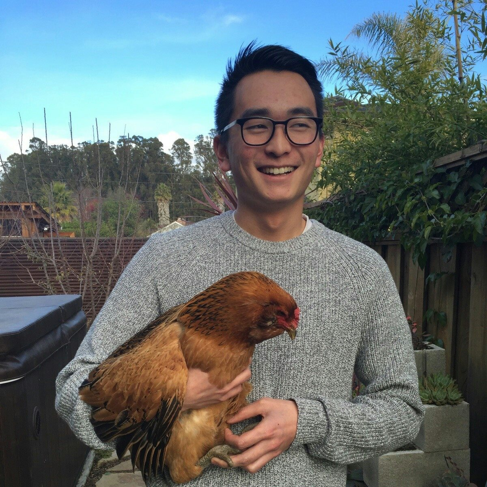

## Hello. 

I’m currently a senior Political Science and French major at Lewis &amp; Clark College. I just finished a semester abroad in Senegal learning French, Wolof, and about life in Sub-Saharan Africa. I was also in Paris for the summer doing marketing at Tagattitude and trying not to think too much about the fact that college is almost over.

When I graduate I am interested in working in tech marketing, or product development.  Entrepreneurship is a passion of mine and I plan on applying these skills to my future work environment.  Most importantly, I hope to continue learning and improving my skills wherever I end up working.

Besides that, I spend my time traveling, drinking too much coffee, dreaming, golfing, skiing, meeting people, playing frisbee, listening to music, eating good food, and trying new things.

## Say Hi

<h4>
rsata@lclark.edu
</h4>

<ul class="icons list-inline">
  <li><a href="http://www.linkedin.com/in/reidsata/">
    
      <i class="fa fa-circle fa-stack-2x"></i>
      <i class="fa fa-linkedin fa-stack-1x fa-inverse"></i>
    
  </a></li> 
  <li><a href="https://github.com/rsata">
    
      <i class="fa fa-circle fa-stack-2x"></i>
      <i class="fa fa-github fa-stack-1x fa-inverse"></i>
    
  </a></li> 
</ul>